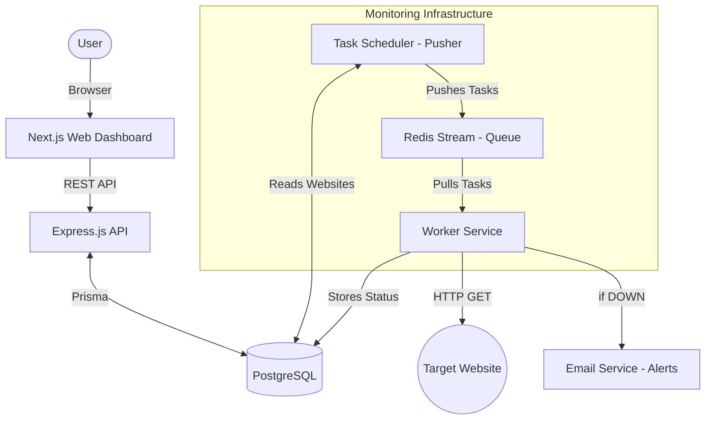

# BetterUptime Clone 🚀

A distributed website monitoring system built with a high-performance event-driven architecture. This project allows users to monitor their websites' uptime and response times from multiple regions and receive instant alerts.

## 🏗️ Architecture

The system is designed as a distributed, scalable monorepo using **Turborepo** and **Bun**.

### 🗺️ Visual Architecture



### 🧩 Components

1.  **`apps/web` (Next.js)**: 
    *   A modern dashboard for users to add websites, view uptime graphs, and monitor status in real-time.
    *   Built with React 19 and Tailwind CSS.

2.  **`apps/api` (Express)**:
    *   Handles user authentication, JWT management, and CRUD operations for monitored websites.
    *   Serves as the main gateway for the frontend.

3.  **`apps/pusher` (Worker Service)**:
    *   A dedicated service that polls the database for all active websites and pushes monitoring tasks into a **Redis Stream**.
    *   Ensures that every website is checked on a configurable interval (currently ~30s).

4.  **`apps/worker` (Monitoring Agent)**:
    *   A high-performance agent that pulls tasks from the Redis Stream using **Consumer Groups**.
    *   Performs HTTP GET requests and records "ticks" (status + latency) in the PostgreSQL database.
    *   **Alerting Engine**: Detects status transitions (Up -> Down or Down -> Up) and triggers email notifications via **Nodemailer**.

5.  **`packages/store`**:
    *   Shared database logic using **Prisma 7**.

6.  **`packages/redisstream`**:
    *   Shared utility for interacting with Redis Streams.

---

## 🛠️ Technology Stack

*   **Runtime**: [Bun](https://bun.sh/)
*   **Language**: [TypeScript](https://www.typescriptlang.org/)
*   **Backend**: [Next.js](https://nextjs.org/), [Express.js](https://expressjs.com/), [Nodemailer](https://nodemailer.com/)
*   **Monorepo**: [Turbo](https://turbo.build/)
*   **ORM**: [Prisma 7](https://www.prisma.io/)
*   **Storage**: [PostgreSQL](https://www.postgresql.org/), [Redis](https://redis.io/)
*   **Infrastructure**: [Docker](https://www.docker.com/)

---

## ⚡ Getting Started

### Prerequisites
*   Docker Desktop
*   [Bun](https://bun.sh/) installed

### Setup & Run
1.  **Spin up infrastructure**: `docker-compose up -d`
2.  **Install dependencies**: `bun install`
3.  **Setup Database**:
    ```bash
    cd packages/store
    npx prisma generate
    npx prisma db push
    ```
4.  **Start all services**: From the root, run `bun run dev`

### 📧 Configuring Alerts
To enable real email alerts, add the following to `apps/worker/.env`:
```env
EMAIL_ENABLED=true
SMTP_HOST=your-smtp-host
SMTP_PORT=587
SMTP_USER=your-user
SMTP_PASS=your-password
```

---

## 🧪 Testing
```bash
cd apps/tests
bun test
```
